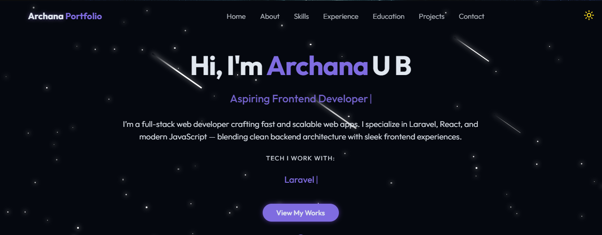

# 🌐 Archana's Developer Portfolio

Welcome to my personal **React Developer Portfolio** built using **React.js**, **Tailwind CSS v4**, and **Framer Motion**. This project showcases my skills, projects, and experiences in a modern, interactive, and responsive design.

---
 
## 🚀 Tech Stack

- **React.js** – Component-based UI
- **Tailwind CSS v4** – Utility-first CSS framework
- **Framer Motion** – Smooth animations and transitions
- **React Router** – Routing and navigation
- **Responsive Design** – Fully mobile-optimized layout

---

## ✨ Features

- 🔥 Animated transitions with Framer Motion  
- 📱 Fully responsive and mobile-friendly  
- 🧠 Projects section with dynamic data  
- 🗂️ Resume and contact integration  
- 🌙 Light/Dark mode support *(optional)*  
- 🧭 Smooth scroll and section highlights  

---

## 📸 Live Preview

👉 [View Live Demo](https://archanaub04.github.io/)

---

